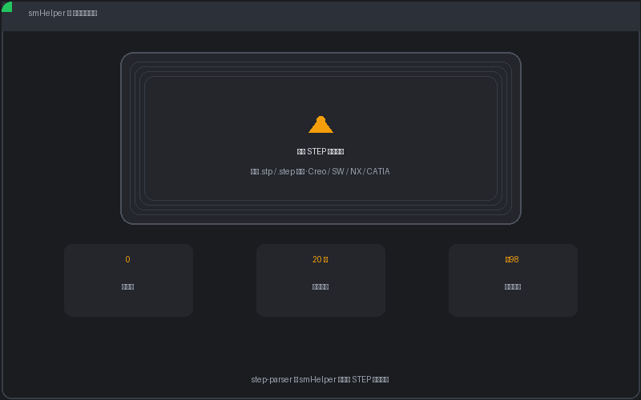

# step-parser · STEP 钣金几何解析库

[](https://www.python.org/downloads/)
[](LICENSE)
[](https://pypi.org/project/step-parser/)

**纯 Python · 零依赖 · ISO 10303-21 (STEP P21) 解析器，专为钣金件几何特征提取设计。**



> `step-parser` 是 [**smHelper**](https://smhelper.gzyrwl.com) 的核心 STEP 解析引擎。smHelper 是钣金报价桌面工具：拖入 STEP 图纸 → 秒出带 3D 视图的专业报价单。**20 张免费试用，¥98 永久授权。**

---

## 功能

| 类别 | 说明 |
|------|------|
| **格式支持** | STEP AP203 / AP214 / AP242 (ISO 10303-21 P21 ASCII) |
| **CAD 兼容** | Creo / SolidWorks / NX / CATIA / Inventor / FreeCAD / Solid Edge / Fusion 360 / Onshape |
| **装配结构** | 多零件装配树、实例计数、PRODUCT→CLOSED_SHELL 引用链追踪 |
| **几何计算** | 包围盒、表面积、展开面积、外轮廓切割长度、周长 |
| **钣金特征** | 孔明细（按直径分组）、穿孔数、折弯检测、板厚估算 |
| **文件验证** | 解析前预检：实体统计、CAD 来源识别、问题诊断 |
| **2D 轮廓** | 提取最大面的外轮廓 + 内孔，输出局部 2D 坐标 |

📦 `pip install step-parser` · 🐍 Python 3.9+ · 🪶 纯标准库

---

## 快速开始

### 安装

```bash
pip install step-parser
```

### 三行代码

```python
from step_parser import parse, analyze, extract_assembly

store = parse('零件.stp')                          # 解析 STEP 文件
assembly = extract_assembly(store)                 # 提取装配结构
result = analyze(store, assembly['parts'][0])      # 计算几何属性
print(result['name'], result['bbox_mm']['label'])  # → "支架" "120.5×80.3×2.0"
```

### 命令行

```bash
# 解析并输出几何报告
python -m step_parser 零件.stp
```

---

## 使用指南

### 解析前验证

```python
from step_parser import validate

report = validate('零件.stp')
print(report['status'])      # 'ok' / 'warn' / 'fail'
print(report['info'])        # 文件名、CAD 来源、Schema、单位
print(report['stats'])       # 各类型实体数量
print(report['warnings'])    # 潜在问题（非实体、三角化面等）
```

### 解析并提取装配结构

```python
from step_parser import parse, extract_assembly

store = parse('装配体.stp')

# EntityStore：懒解析 + 引用图
print(f"已解析 {len(store._entities)} 个实体")
print(store.get_type(123))        # 按 ID 获取实体类型
print(store.get_args(123))        # 获取已解析的参数（懒加载）

# 提取装配树
assembly = extract_assembly(store)
for part in assembly['parts']:
    print(f"{part['name']}: {part['instances']} 件, shell_id={part['shell_id']}")
```

### 几何分析

```python
from step_parser import analyze

for part in assembly['parts']:
    result = analyze(store, part)

    print(result['bbox_mm'])           # {'width': 120.5, 'depth': 80.3, 'height': 2.0}
    print(result['surface_area_m2'])   # 0.0213 m²
    print(result['blank_area_m2'])     # 0.0095 m²
    print(result['outer_profile_m'])   # 外轮廓切割长度 (m)

    for h in result['holes']:
        print(f"Ø{h['diameter_mm']}mm × {h['count']}")

    print(f"折弯: {result['bend_count']}  穿孔: {result['pierce_count']}")
    print(f"板厚: {result['thickness_mm']} mm  类型: {result['type']}")
```

### 低级 API — 直接操作 BREP

```python
from step_parser import collect_shell_geometry, classify_faces, get_loop_edges, compute_face_area

geom = collect_shell_geometry(store, shell_id)
faces = classify_faces(store, geom['face_ids'])

for face in faces:
    area = compute_face_area(store, face)
    edges = get_loop_edges(store, face['outer_loop_id'])
    print(f"{face['surface_type']}: area={area:.1f}mm², edges={len(edges)}")
```

---

## 提取的信息明细

- 📦 **包围盒** — 长×宽×高 (mm)
- 📐 **表面积** / **展开面积** (m²)
- ✂️ **外轮廓切割长度** (m)
- 🕳️ **孔明细** — 按直径分组，含数量
- 🔩 **工艺推测** — 根据孔径推测攻牙/压铆
- 🔧 **折弯数** — 自动识别折弯特征
- 📏 **板厚** — 从平行平面间距估算
- ⚖️ **净重** — 基于 SPCC 密度估算
- 🏷️ **零件类型** — 平板件 / 折弯件

---

## 本库不做什么

- ❌ 不渲染 3D 图形（可用 [occt-import-js](https://github.com/kovacsv/occt-import-js) / Three.js / pythonocc）
- ❌ 不修改或写入 STEP 文件（只读解析）
- ❌ 不生成 CAM 刀路
- ❌ 不含报价/计价逻辑

---

## CAD 兼容性

以下 CAD 系统导出的 STEP 均已测试：

| CAD 系统 | 协议 | 备注 |
|----------|------|------|
| **Creo Parametric** (PTC) | AP203/AP214 | PRODUCT_DEFINITION_FORMATION_WITH_SPECIFIED_SOURCE |
| **SolidWorks** (Dassault) | AP203/AP214 | 标准 PRODUCT_DEFINITION_FORMATION |
| **NX** (Siemens) | AP203/AP214 | 标准实体命名 |
| **CATIA** (Dassault) | AP203/AP214 | 注意单位系统差异 |
| **Inventor** (Autodesk) | AP203/AP214 | 标准 |
| **FreeCAD** | AP203/AP214 | Open CASCADE 导出器 |
| **Solid Edge** (Siemens) | AP203/AP214 | 标准 |
| **Fusion 360** (Autodesk) | AP203/AP214 | 标准 |
| **Onshape** (PTC) | AP203/AP214 | 标准 |

> ⚠️ 文件必须导出为 **BREP**（精确几何），而非三角化网格。三角化 STEP（STL 转换而来）可解析但精度降低，验证阶段会标记。

---

## 📢 smHelper — 完整钣金报价工具

`step-parser` 是 **[smHelper](https://smhelper.gzyrwl.com)** 的核心解析引擎。

### 比库多了什么？

| 本库 (step-parser) | smHelper 桌面应用 |
|-------------------|------------------|
| ✅ STEP 解析 + 几何提取 | ✅ 以上全部 |
| ❌ 3D 视图 | ✅ WebGL 3D 旋转/缩放 |
| ❌ 报价单生成 | ✅ 专业报价单 HTML（6 套主题） |
| ❌ 价格计算 | ✅ 材料/切割/折弯/孔/表处/税 全项计算 |
| ❌ GUI | ✅ PyQt6 桌面界面 · 拖拽即用 |
| ❌ 加密 | ✅ AES-256 报价数据加密 |

🆓 **20 张免费试用** · ¥98 永久授权 · 👉 [**访问官网 →**](https://smhelper.gzyrwl.com)

---

## License

MIT — 详见 [LICENSE](LICENSE)

---

## Links

- 🏠 [smHelper 官网](https://smhelper.gzyrwl.com)
- 🐙 [GitHub](https://github.com/luoyuanhu/step-parser)
- 🏯 [Gitee](https://gitee.com/gzyrwl/step-parser)
- 📦 [PyPI](https://pypi.org/project/step-parser/)
- 🐛 [反馈 / Issues](https://github.com/luoyuanhu/step-parser/issues)

---

> *Pure Python STEP P21 file parser for sheet metal geometry extraction. Zero external dependencies. Works with Creo, SolidWorks, NX, CATIA, Inventor, FreeCAD, and more.*
